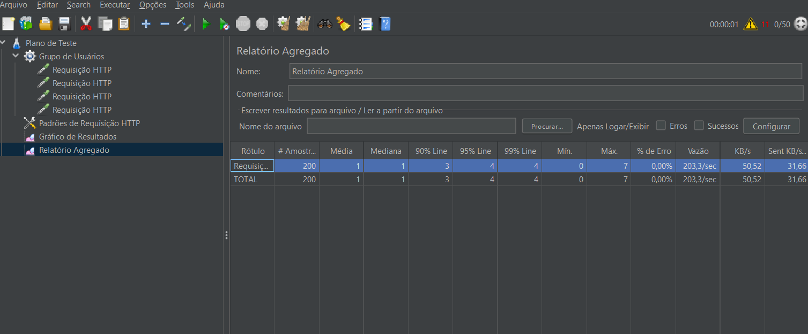
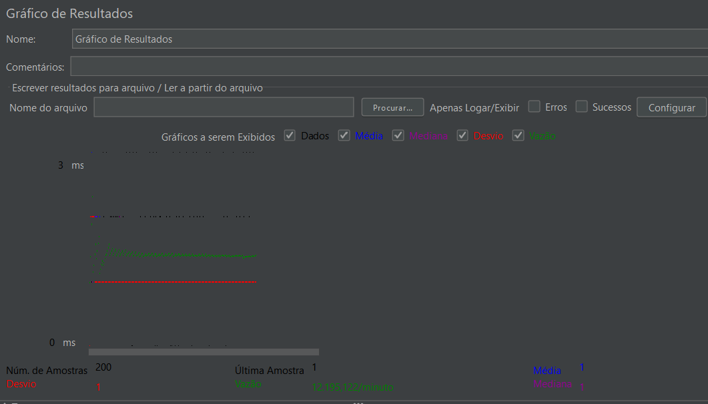

Relatório Final: Qualidade e Teste de Software
Grupo: Jefferson Ademir Zimmermann e Ana Clara

1. Introdução e Objetivo

Este relatório descreve o desenvolvimento, os testes e a documentação do Trabalho Final da disciplina de Qualidade e Teste de Software. O objetivo principal do projeto foi construir um peque sistemano de cálculo, implementar testes unitários abrangentes, expor as funcionalidades através de uma API REST e validar sua performance por meio de um teste de carga.

2. Detalhes do Projeto
   
  O tema escolhido para o desenvolvimento do sistema foi o Tema 2: Cálculos de Finanças Pessoais.

  2.1. Tecnologias Utilizadas
    O sistema foi desenvolvido com o seguinte stack tecnológico, conforme o código implementado:

    Linguagem principal para cálculos: Java
    
    Framework de Teste Unitário: JUnit 5
    
    API REST: Node.js + Express
    
    Ferramenta de Teste de Carga: Apache JMeter
    
    Gerenciamento de Dependências Java: Maven

3. Classe de Cálculo e Operações
   
  A lógica central do sistema reside na classe principal de cálculo, Main.CalculadoraFinanceira, que contém as quatro operações obrigatórias relacionadas a finanças pessoais.

3.1. Operação 1: Juros Simples
    Esta operação calcula os juros com base em capitalização linear.
    
    Entrada Esperada: capital (float), taxa (float), tempo (int).
    
    Cálculo: $$juros = capital \cdot taxa \cdot tempo$$
    
    O resultado final é o valor total dos juros (a API, quando implementada, deve retornar o valor total dos juros e o Montante).

  3.2. Operação 2: Juros Compostos
    Esta operação calcula o montante final em regime de capitalização composta.
    
    Entrada Esperada: capital (float), taxa (float), tempo (int).
  
    Cálculo: $$montante = capital \cdot (1 + taxa)^{tempo}$$
  
    O resultado final é o valor total do Montante.

  3.3. Operação 3: Valor Futuro
    Esta operação determina o valor futuro de um investimento com base em uma taxa de juros e período de tempo.
    
    Entrada Esperada: valorPresente (float), taxa (float), tempo (int).
   
    Cálculo: $$VF = VP \cdot (1 + taxa)^{tempo}$$
   
    O resultado final deve retornar o Valor Futuro.

  3.4. Operação 4: Valor Presente
    Esta operação calcula o valor presente (descontado) necessário para atingir um valor futuro.
    
    Entrada Esperada: valorFuturo (float), taxa (float), tempo (int).
   
    Cálculo: $$VP = VF / (1 + taxa)^{tempo}$$
   
    O resultado final deve retornar o Valor Presente.

4. Implementação da API REST

    A API foi implementada usando Node.js e Express, expondo cada operação de cálculo em um endpoint dedicado.

    4.1. Endpoint Base
        http://localhost:3000/financeiro

    4.2. Endpoints Disponíveis
        Operação	    Método	Caminho
        Juros Simples	GET	    /financeiro/juros-simples?a=...&b=...&c=...
        Juros Compostos	GET	    /financeiro/juros-compostos?a=...&b=...&c=...
        Valor Futuro	GET	    /financeiro/valor-futuro?a=...&b=...&c=...
        Valor Presente	GET	    /financeiro/valor-presente?a=...&b=...&c=...
    
    4.3. Exemplo de Requisição
        GET http://localhost:3000/financeiro/juros-simples?a=1000&b=0.1&c=2
    
    4.4. Tratamento de Erros
        A API retorna mensagens de erro em JSON quando:
    
        parâmetros não são números,
        
        valores inválidos são enviados,
        
        exceções internas são lançadas.
        
        Exemplo:
        
        { "erro": "Parâmetros devem ser números reais." }

    4.5. Testes de API
        O projeto inclui testes automatizados usando Jest + Supertest para validar os endpoints de cálculo financeiro.
        
        Pra rodar os testes:
            npm test
        
        
        Os testes cobrem:
        Juros Simples
        
        Verifica cálculo correto
        
        Verifica erro quando parâmetros não são números
        
        Juros Compostos
        
        Valida o montante final com aproximação numérica

5. Testes Unitários 
   
  Os testes unitários foram completamente implementados na classe CalculadoraFinanceiraTest, utilizando o framework JUnit 5.
  
  Foi garantida a cobertura de todas as quatro operações de cálculo, totalizando 5 testes que incluem:
  
  Validação de Casos de Sucesso: Testes para cada operação principal (Juros Simples, Juros Compostos, Valor Futuro, Valor Presente) confirmando a precisão dos resultados.
  
  Validação de Argumentos Inválidos: Um teste específico que verifica se a exceção IllegalArgumentException é lançada corretamente quando valores negativos são fornecidos como entrada (conforme a lógica implementada).

6. Teste de Carga

    O teste de carga foi executado via Apache JMeter sobre os quatro endpoints da API.
    
    6.1. Configuração planejada:
    
        50 usuários simultâneos (threads)
        
        Período de ramp-up configurado para simular requisições reais
        
        Cada thread executará requisições aos quatro endpoints
    
    6.2. Arquivos
    
        Script JMeter (.jmx): jmeter/Gráfico Agregado.jmx
        
        Relatório de Carga:

7. Vídeo de Apresentação
   
  Link do Vídeo no YouTube: [PREENCHER - Link do YouTube]

8. Uso de Inteligência Artificial
    
  Ferramenta(s) de IA Utilizada(s): GEMINI e ChatGPT
  
  Facilidades Encontradas: Facilitou criar o README do GitHub e deubugar erros.
  
  Dificuldades Encontradas: Ao passar o link do GitHub para a IA analisar e elaborar o README, houveram dificuldades de compreensão do que estava acontecendo em cada etapa. Isso pois, apesar da IA explicar tudo com certeza e não questionar informações em nenhum momento, foi necessário elaborar o prompt múltiplas vezes, dizendo a mesma coisa de maneiras diferentes.
